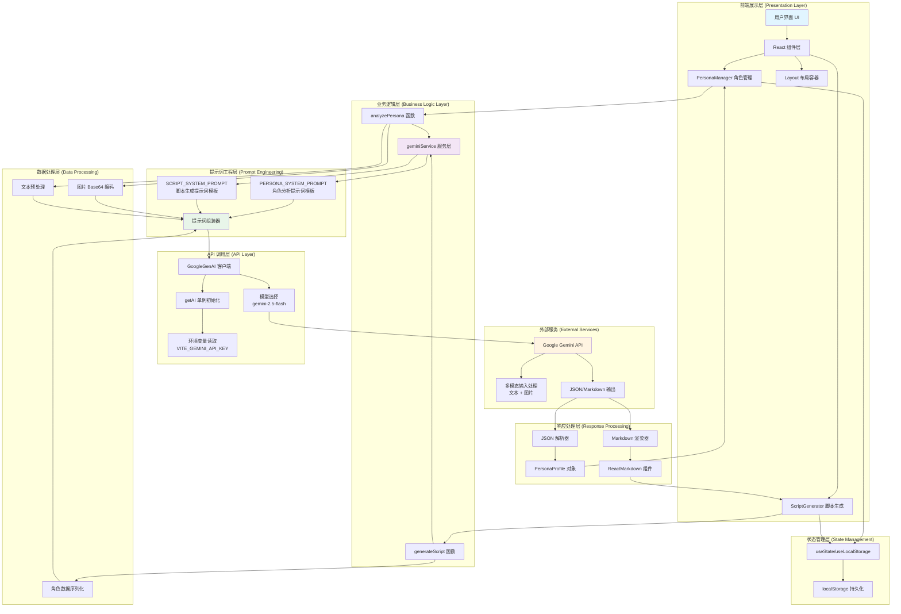

# ScriptAI Agent 架构设计文档

> 作者：架构师视角  
> 版本：1.0  
> 日期：2024

---

## 📐 系统逻辑架构图

### Mermaid 流程图（推荐）



### 纯文本流程图（兼容版本）

```
┌─────────────────────────────────────────────────────────────┐
│                    用户界面 (Browser)                        │
└───────────────────────┬─────────────────────────────────────┘
                        │
                        ▼
┌─────────────────────────────────────────────────────────────┐
│              前端展示层 (Presentation Layer)                │
├─────────────────────────────────────────────────────────────┤
│  ┌──────────────┐  ┌──────────────┐  ┌──────────────┐     │
│  │ PersonaManager│  │ScriptGenerator│  │   Layout     │     │
│  │  角色管理组件 │  │  脚本生成组件  │  │  布局容器    │     │
│  └──────┬───────┘  └──────┬───────┘  └──────────────┘     │
└─────────┼──────────────────┼───────────────────────────────┘
          │                  │
          ▼                  ▼
┌─────────────────────────────────────────────────────────────┐
│           状态管理层 (State Management)                      │
├─────────────────────────────────────────────────────────────┤
│  ┌──────────────────────────────────────────────────────┐   │
│  │  useState / useLocalStorage                          │   │
│  │  └─> localStorage 持久化                            │   │
│  └──────────────────────────────────────────────────────┘   │
└─────────┬──────────────────┬───────────────────────────────┘
          │                  │
          ▼                  ▼
┌─────────────────────────────────────────────────────────────┐
│         业务逻辑层 (Business Logic Layer)                   │
├─────────────────────────────────────────────────────────────┤
│  ┌──────────────┐              ┌──────────────┐             │
│  │analyzePersona│              │generateScript│             │
│  │  角色分析    │              │  脚本生成    │             │
│  └──────┬───────┘              └──────┬───────┘             │
│         └──────────────┬──────────────┘                     │
│                        ▼                                    │
│              ┌──────────────────┐                           │
│              │ geminiService    │                           │
│              │   服务层         │                           │
│              └────────┬─────────┘                           │
└───────────────────────┼─────────────────────────────────────┘
                        │
                        ▼
┌─────────────────────────────────────────────────────────────┐
│       提示词工程层 (Prompt Engineering)                      │
├─────────────────────────────────────────────────────────────┤
│  ┌──────────────────────┐  ┌──────────────────────┐        │
│  │ PERSONA_SYSTEM_PROMPT│  │SCRIPT_SYSTEM_PROMPT  │        │
│  │  角色分析提示词模板  │  │  脚本生成提示词模板  │        │
│  └──────────┬───────────┘  └──────────┬───────────┘        │
│             └──────────────┬──────────┘                     │
│                            ▼                                │
│                  ┌──────────────────┐                        │
│                  │  提示词组装器    │                        │
│                  └────────┬─────────┘                        │
└───────────────────────────┼──────────────────────────────────┘
                            │
                            ▼
┌─────────────────────────────────────────────────────────────┐
│         数据处理层 (Data Processing)                        │
├─────────────────────────────────────────────────────────────┤
│  ┌──────────────┐  ┌──────────────┐  ┌──────────────┐      │
│  │ 图片Base64   │  │  文本预处理  │  │ 数据序列化   │      │
│  │   编码       │  │              │  │              │      │
│  └──────────────┘  └──────────────┘  └──────────────┘      │
└───────────────────────────┬──────────────────────────────────┘
                            │
                            ▼
┌─────────────────────────────────────────────────────────────┐
│           API 调用层 (API Layer)                             │
├─────────────────────────────────────────────────────────────┤
│  ┌──────────────────────────────────────────────────────┐  │
│  │  GoogleGenAI 客户端                                   │  │
│  │  ├─> getAI() 单例初始化                              │  │
│  │  ├─> 环境变量读取 (VITE_GEMINI_API_KEY)              │  │
│  │  └─> 模型选择 (gemini-2.5-flash)                     │  │
│  └──────────────────────────────────────────────────────┘  │
└───────────────────────────┬──────────────────────────────────┘
                            │
                            ▼
┌─────────────────────────────────────────────────────────────┐
│        外部服务 (External Services)                          │
├─────────────────────────────────────────────────────────────┤
│  ┌──────────────────────────────────────────────────────┐  │
│  │         Google Gemini API                             │  │
│  │  ├─> 多模态输入处理 (文本 + 图片)                     │  │
│  │  └─> JSON/Markdown 输出                               │  │
│  └──────────────────────────────────────────────────────┘  │
└───────────────────────────┬──────────────────────────────────┘
                            │
                            ▼
┌─────────────────────────────────────────────────────────────┐
│       响应处理层 (Response Processing)                       │
├─────────────────────────────────────────────────────────────┤
│  ┌──────────────┐              ┌──────────────┐             │
│  │ JSON 解析器  │              │Markdown渲染器│             │
│  │              │              │              │             │
│  └──────┬───────┘              └──────┬───────┘             │
│         │                             │                     │
│         ▼                             ▼                     │
│  ┌──────────────┐              ┌──────────────┐            │
│  │PersonaProfile│              │ReactMarkdown  │            │
│  │   对象       │              │   组件        │            │
│  └──────────────┘              └──────────────┘             │
└─────────────────────────────────────────────────────────────┘
```

---

## 🧩 核心组成部分详解

### 1. **输入处理层 (Input Processing)**

#### 1.1 用户输入收集
- **角色创建输入**：
  - 文本样本（Writing/Speaking Sample）
  - 图片上传（Base64 编码）
  - 角色名称
  
- **脚本生成输入**：
  - 主题/内容（Topic）
  - 目标平台选择（Platform）
  - 模式选择（创建/重写）
  - 已选角色（Persona）

#### 1.2 数据预处理
```typescript
// 图片处理
const cleanBase64 = (dataUrl: string) => {
  return dataUrl.split(',')[1]; // 移除 data:image/jpeg;base64, 前缀
};

// MIME 类型检测
const mimeType = imageDataUrl.startsWith('data:image/png') ? 'image/png' : 'image/jpeg';
```

---

### 2. **提示词模板层 (Prompt Templates)**

#### 2.1 角色分析提示词 (PERSONA_SYSTEM_PROMPT)
```typescript
const PERSONA_SYSTEM_PROMPT = `
You are an expert Persona Analyst for a Video Script Writing System.
Your task is to analyze text samples and an image of a person to create a structured "Style Profile".

Analyze the input based on:
1. Text Features: Sentence structure preference, vocabulary habits...
2. Visual Features (from image): Appearance description...

Output the result in strict JSON format matching this schema:
{
  "languageFeatures": ["feature1", "feature2"],
  "visualFeatures": ["feature1", "feature2"],
  "platformAdvice": {"General": "advice"},
  "sampleSentences": ["example1", "example2"]
}
Only output the JSON.
`;
```

**设计要点**：
- 明确角色定义（Expert Persona Analyst）
- 结构化输出要求（JSON Schema）
- 多模态输入支持（文本 + 图片）

#### 2.2 脚本生成提示词 (SCRIPT_SYSTEM_PROMPT)
```typescript
const SCRIPT_SYSTEM_PROMPT = `
You are a Professional Cross-Platform Video Script AI Agent.
Your goal is to generate optimized video scripts...

Output Format (Markdown):
# Script for [Platform]
## 1. Style Match Analysis
## 2. Visual/Acting Suggestions
## 3. The Script
## 4. Metadata
`;
```

**设计要点**：
- 平台适配指令（TikTok、YouTube、小红书等）
- 结构化 Markdown 输出
- 角色风格模仿要求

---

### 3. **模型调用层 (Model Invocation)**

#### 3.1 API 客户端初始化
```typescript
const getAI = (): GoogleGenerativeAI => {
  if (!ai) {
    const apiKey = import.meta.env.VITE_GEMINI_API_KEY;
    ai = new GoogleGenerativeAI(apiKey);
  }
  return ai;
};
```

**设计模式**：单例模式（Singleton）
- 避免重复创建客户端实例
- 延迟初始化（Lazy Initialization）
- 环境变量隔离

#### 3.2 模型调用流程
```typescript
// 1. 获取模型实例
const model = aiInstance.getGenerativeModel({ 
  model: 'gemini-2.5-flash'
}, { apiVersion: 'v1beta' });

// 2. 组装多模态输入
const result = await model.generateContent([
  { text: SYSTEM_PROMPT },  // 系统提示词
  imagePart,                 // 图片数据
  { text: userPrompt }       // 用户输入
]);

// 3. 提取响应
const response = await result.response;
const text = response.text();
```

---

### 4. **输出解析层 (Output Parsing)**

#### 4.1 JSON 解析（角色分析）
```typescript
try {
  analysisData = JSON.parse(jsonText);
} catch (e) {
  // 容错处理：返回默认结构
  analysisData = {
    languageFeatures: ["Analysis failed to parse"],
    visualFeatures: [],
    platformAdvice: {},
    sampleSentences: []
  };
}
```

#### 4.2 Markdown 渲染（脚本生成）
```typescript
<ReactMarkdown>{result}</ReactMarkdown>
```

---

## 🔄 数据流转完整路径

### 场景：用户创建角色并生成脚本

#### **阶段 1：角色创建流程**

```
用户输入
  ↓
[PersonaManager 组件]
  ├─ 收集：name, sampleText, selectedImage
  ├─ 验证：检查必填字段
  └─ 调用：handleCreatePersona()
      ↓
[geminiService.analyzePersona()]
  ├─ 步骤 1：图片预处理
  │   ├─ 检测 MIME 类型 (PNG/JPEG)
  │   └─ Base64 编码清理
  │
  ├─ 步骤 2：提示词组装
  │   ├─ 系统提示词 (PERSONA_SYSTEM_PROMPT)
  │   ├─ 用户输入 (name + sampleText)
  │   └─ 图片数据 (imagePart)
  │
  ├─ 步骤 3：API 调用
  │   ├─ getAI() → 初始化客户端
  │   ├─ getGenerativeModel() → 选择模型
  │   └─ generateContent() → 发送请求
  │
  ├─ 步骤 4：响应处理
  │   ├─ response.text() → 提取文本
  │   ├─ JSON.parse() → 解析 JSON
  │   └─ 构建 PersonaProfile 对象
  │
  └─ 返回：PersonaProfile
      ↓
[PersonaManager 组件]
  ├─ setPersonas() → 更新状态
  ├─ localStorage.setItem() → 持久化
  └─ UI 更新 → 显示新角色
```

#### **阶段 2：脚本生成流程**

```
用户输入
  ↓
[ScriptGenerator 组件]
  ├─ 收集：platform, persona, topic, mode
  ├─ 验证：检查必填字段
  └─ 调用：handleGenerate()
      ↓
[geminiService.generateScript()]
  ├─ 步骤 1：数据准备
  │   ├─ 序列化角色数据 (JSON.stringify)
  │   ├─ 组装用户提示词
  │   └─ 平台特定指令
  │
  ├─ 步骤 2：提示词组装
  │   ├─ 系统提示词 (SCRIPT_SYSTEM_PROMPT)
  │   └─ 用户提示词 (prompt)
  │
  ├─ 步骤 3：API 调用
  │   ├─ getAI() → 复用客户端
  │   ├─ getGenerativeModel() → 选择模型
  │   └─ generateContent() → 发送请求
  │
  ├─ 步骤 4：响应处理
  │   └─ response.text() → 提取 Markdown
  │
  └─ 返回：string (Markdown)
      ↓
[ScriptGenerator 组件]
  ├─ setResult() → 更新状态
  ├─ useLocalStorage → 持久化输入
  └─ ReactMarkdown → 渲染输出
```

---

## 🎯 框架选择与设计思想

### 为什么选择原生 API 而非 LangChain/AutoGPT？

#### **1. 技术选型对比**

| 特性 | 原生 API | LangChain | AutoGPT |
|------|---------|-----------|---------|
| **学习曲线** | ⭐ 简单 | ⭐⭐⭐ 复杂 | ⭐⭐⭐⭐ 很复杂 |
| **依赖体积** | ⭐ 小 | ⭐⭐⭐ 大 | ⭐⭐⭐⭐ 很大 |
| **控制粒度** | ⭐⭐⭐⭐⭐ 完全控制 | ⭐⭐⭐ 中等 | ⭐⭐ 受限 |
| **部署复杂度** | ⭐ 简单 | ⭐⭐⭐ 中等 | ⭐⭐⭐⭐ 复杂 |
| **定制化能力** | ⭐⭐⭐⭐⭐ 高 | ⭐⭐⭐ 中等 | ⭐⭐ 低 |

#### **2. 核心设计思想**

##### **2.1 轻量级架构 (Lightweight Architecture)**
```
设计原则：最小化依赖，最大化控制
├─ 只依赖 @google/generative-ai（官方 SDK）
├─ 无中间抽象层（减少性能损耗）
└─ 直接 API 调用（响应更快）
```

**优势**：
- 打包体积小（~250KB vs LangChain ~2MB+）
- 启动速度快
- 适合前端部署（GitHub Pages、Vercel）

##### **2.2 显式控制流 (Explicit Control Flow)**
```typescript
// 原生 API：每一步都清晰可见
const model = aiInstance.getGenerativeModel({ model: 'gemini-2.5-flash' });
const result = await model.generateContent([...]);
const response = await result.response;
const text = response.text();

// vs LangChain：黑盒抽象
const chain = createChain(...);
const result = await chain.invoke({...}); // 内部做了什么？
```

**优势**：
- 易于调试（每一步都可追踪）
- 易于优化（知道瓶颈在哪里）
- 易于理解（代码即文档）

##### **2.3 提示词工程优先 (Prompt Engineering First)**
```
设计理念：通过精心设计的提示词，而非复杂的框架，实现 AI 能力
├─ 结构化提示词模板
├─ 明确的输出格式要求
└─ 上下文信息注入
```

**示例**：
```typescript
// 通过提示词实现结构化输出
const SYSTEM_PROMPT = `
Output the result in strict JSON format matching this schema:
{
  "languageFeatures": ["feature1", "feature2"],
  ...
}
Only output the JSON.
`;
```

##### **2.4 渐进式增强 (Progressive Enhancement)**
```
架构演进路径：
阶段 1：基础功能（当前）
  └─ 直接 API 调用 + 简单状态管理

阶段 2：功能增强（未来可选）
  ├─ 添加缓存层（减少 API 调用）
  ├─ 添加重试机制（提高可靠性）
  └─ 添加流式输出（改善用户体验）

阶段 3：高级功能（按需）
  ├─ 多模型切换（A/B 测试）
  ├─ 提示词版本管理
  └─ 性能监控
```

---

### 3. 架构模式应用

#### **3.1 服务层模式 (Service Layer Pattern)**
```
components/          → 展示层（UI）
  ↓
services/            → 业务逻辑层（API 调用）
  ↓
@google/generative-ai → 基础设施层（SDK）
```

**好处**：
- 关注点分离（UI 与业务逻辑解耦）
- 易于测试（可以 Mock 服务层）
- 易于复用（多个组件可调用同一服务）

#### **3.2 单例模式 (Singleton Pattern)**
```typescript
let ai: GoogleGenerativeAI | null = null;

const getAI = (): GoogleGenerativeAI => {
  if (!ai) {
    ai = new GoogleGenerativeAI(apiKey);
  }
  return ai;
};
```

**好处**：
- 资源复用（避免重复创建客户端）
- 全局唯一（确保配置一致性）

#### **3.3 策略模式 (Strategy Pattern)**
```typescript
// 不同平台使用不同的生成策略（通过提示词实现）
const platformInstructions = {
  [Platform.DOUYIN]: "Fast pace, 3-second hook, trending BGM",
  [Platform.YOUTUBE]: "SEO keywords, clear structure",
  [Platform.REDNOTE]: "Use emojis, keywords, emotional resonance"
};
```

---

## 📊 性能优化策略

### 1. **代码分割 (Code Splitting)**
```typescript
// vite.config.ts
rollupOptions: {
  output: {
    manualChunks: {
      'react-vendor': ['react', 'react-dom'],
      'google-ai': ['@google/generative-ai'],
    },
  },
}
```

### 2. **数据持久化 (Data Persistence)**
```typescript
// 使用 useLocalStorage Hook
const [topic, setTopic] = useLocalStorage<string>('app_script_input', '');
```

### 3. **延迟初始化 (Lazy Initialization)**
```typescript
// API 客户端只在首次使用时创建
const getAI = (): GoogleGenerativeAI => {
  if (!ai) { /* 初始化 */ }
  return ai;
};
```

---

## 🔮 未来扩展方向

### 1. **添加缓存层**
```typescript
// 缓存相同输入的 API 响应
const cache = new Map<string, PersonaProfile>();

export const analyzePersona = async (...) => {
  const cacheKey = `${name}-${sampleText}-${imageHash}`;
  if (cache.has(cacheKey)) {
    return cache.get(cacheKey);
  }
  // ... API 调用
  cache.set(cacheKey, result);
  return result;
};
```

### 2. **流式输出支持**
```typescript
// 实时显示生成进度
const stream = await model.generateContentStream([...]);
for await (const chunk of stream) {
  setPartialResult(chunk.text());
}
```

### 3. **多模型支持**
```typescript
// 根据任务选择不同模型
const modelMap = {
  'persona-analysis': 'gemini-2.5-flash',
  'script-generation': 'gemini-1.5-pro',
};
```

---

## 📝 总结

### 核心设计原则

1. **简单优于复杂**：选择原生 API 而非重型框架
2. **显式优于隐式**：清晰的代码流程，易于理解和维护
3. **渐进式增强**：从简单开始，按需添加复杂功能
4. **提示词工程**：通过精心设计的提示词实现 AI 能力

### 适用场景

✅ **适合**：
- 中小型 AI 应用
- 前端部署（静态站点）
- 快速原型开发
- 需要精细控制的场景

❌ **不适合**：
- 需要复杂 Agent 编排
- 需要大量工具集成
- 需要自动任务规划

---

**文档维护**：此架构文档应与代码同步更新，反映最新的设计决策。

